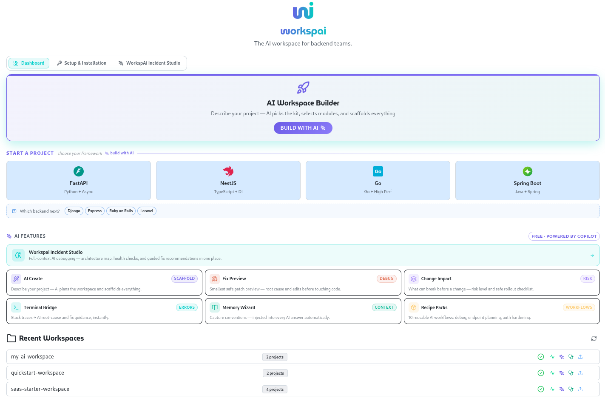
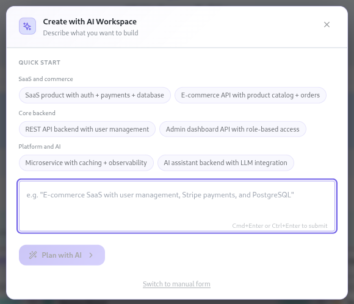
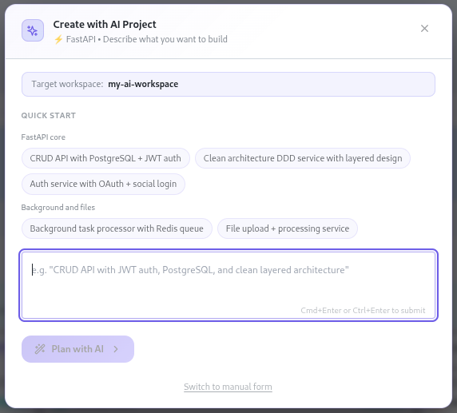
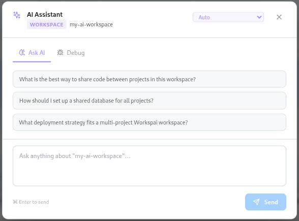
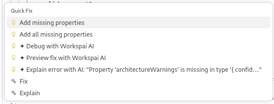
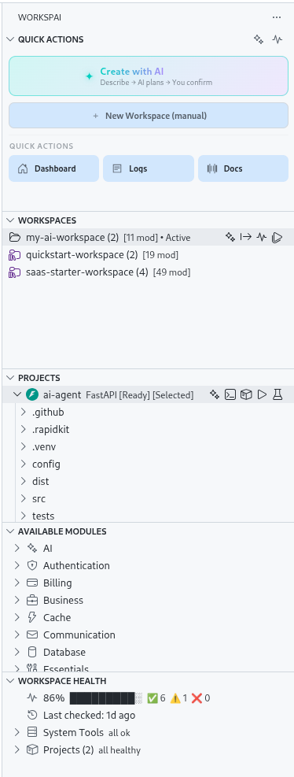
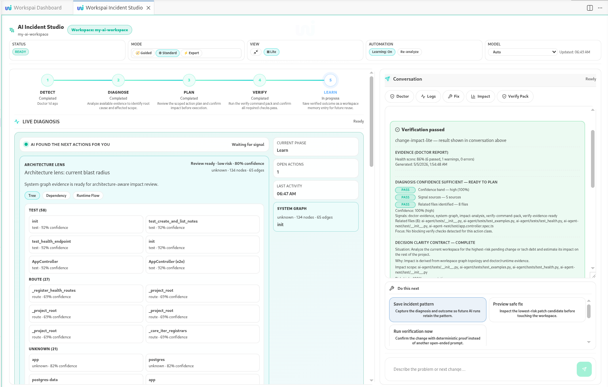
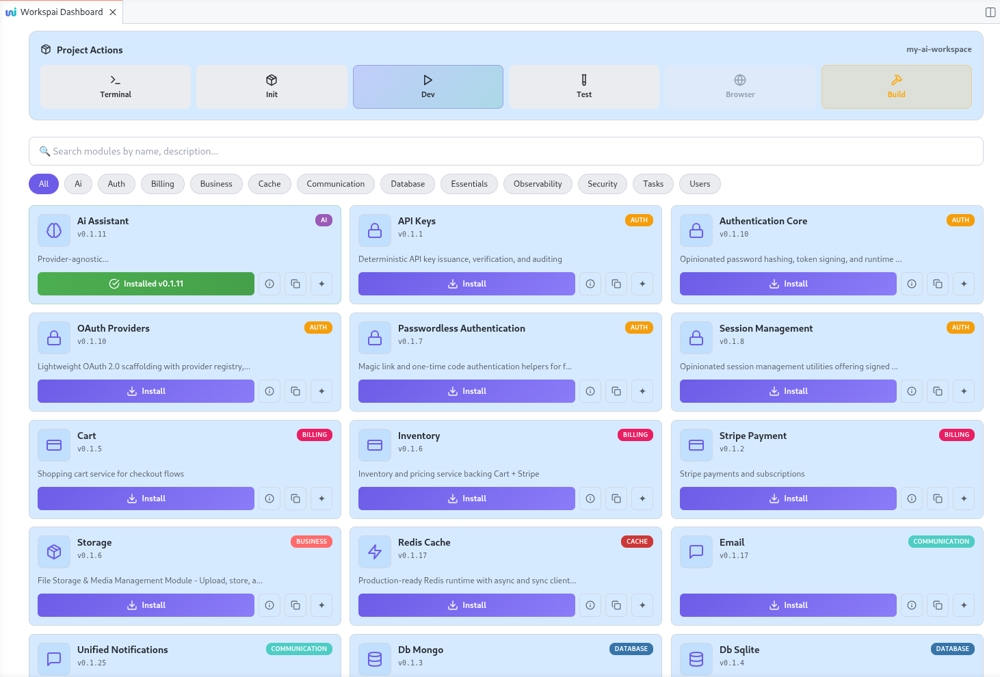

# Workspai for VS Code

<div align="center">

**The AI workspace for backend teams.**

Scaffold projects from intent. Debug with full context. Ship faster — all inside VS Code.

[](https://marketplace.visualstudio.com/items?itemName=rapidkit.rapidkit-vscode)
[](https://marketplace.visualstudio.com/items?itemName=rapidkit.rapidkit-vscode)
[](https://www.npmjs.com/package/rapidkit)

[Install](https://marketplace.visualstudio.com/items?itemName=rapidkit.rapidkit-vscode) · [Docs](https://www.workspai.com/) · [Issues](https://github.com/rapidkitlabs/rapidkit-vscode/issues)

</div>

---

## What it does

Workspai is a VS Code extension that wraps the RapidKit CLI (`rapidkit` on npm) and brings AI-powered workspace management to backend teams. It knows your project structure, runs your CLI, and uses GitHub Copilot to scaffold, debug, and analyze — all from a single sidebar.

**Supported frameworks:** FastAPI · NestJS · Spring Boot · Go/Fiber · Go/Gin

---

## Features

### Dashboard



The main dashboard brings the core flows together in one place: AI workspace creation, framework quick-start cards, AI tools, and recent workspaces. It is the fastest entry point for both new scaffolds and ongoing work.

### AI Workspace Builder



Describe what you want to build in plain language. Workspai plans the workspace, selects the right starter shape, and turns intent into a scaffolded backend setup.

### AI Project Creation



Create a project inside the selected workspace with framework-aware presets. The AI project flow keeps the workspace context, target framework, and starter patterns aligned from the start.

### AI Assistant



Open a context-aware assistant directly inside VS Code. Ask architecture questions, debug issues with workspace awareness, and switch between guided prompts and direct input without leaving the extension.

### Editor Quick Fixes



Workspai also plugs into the editor quick-fix flow. From inline diagnostics, you can preview a fix with AI, debug with Workspai AI, or explain an error without leaving the current file.

### Sidebar Explorer



The sidebar is the operational control surface for Workspai: quick actions, workspaces, projects, available modules, and workspace health. Project-level runtime actions stay one click away.

### Workspai Incident Studio



The dedicated AI debugging environment for backend teams. Open from the **Incident Studio** tab in the dashboard — it loads your full workspace context and runs a structured analysis.

What it covers in a single session:
- **Architecture map** — project graph, dependencies, and module relationships
- **Workspace health** — doctor checks, missing configs, and environment issues  
- **AI-guided fix recommendations** — root-cause, patch preview, and rollout checklist
- **Scope-aware analysis** — target a specific project or the full workspace

No copy-pasting logs. No context switching. Select scope → run analysis → get actionable output.

### Module Browser



Browse 27+ production-ready modules by category, filter them quickly, and install them into the active project. The module browser is designed for fast discovery, comparison, and one-click install flows.

---

## AI Tools — Powered by Copilot

| Tool | What it does |
|------|-------------|
| **AI Create** | Describe your project — AI plans and scaffolds the workspace |
| **Fix Preview** | Smallest safe patch before touching code — root cause + edits |
| **Change Impact** | What can break before a change — risk level + rollout checklist |
| **Terminal Bridge** | Stack traces → structured root-cause and fix in one click |
| **Memory Wizard** | Capture conventions — injected into every AI answer automatically |
| **Recipe Packs** | 10 reusable AI workflows: debug, endpoint planning, auth hardening |

All AI features are free and powered by GitHub Copilot.

---

## Quick Start

```bash
# 1. Open Command Palette
Ctrl+Shift+P → "Workspai: Create Workspace"

# 2. Check requirements
Ctrl+Shift+P → "Workspai: Run System Check"

# 3. Create your first project
Ctrl+Shift+P → "Workspai: Create Project"
```

Your project ships with full structure, dependencies, dev server, and API docs at `/docs`.

```bash
npx rapidkit init    # Install dependencies
npx rapidkit dev     # Start dev server
npx rapidkit test    # Run tests
```

---

## Frameworks & Modules

| Framework | Language | Stack |
|-----------|----------|-------|
| **FastAPI** | Python | Async, auto-docs, Poetry |
| **NestJS** | TypeScript | Modular, DI, decorators |
| **Spring Boot** | Java | REST, JPA, Maven, auto-config |
| **Go/Fiber** | Go | High-performance HTTP, Swagger |
| **Go/Gin** | Go | Minimal HTTP, routing, Swagger |

<details>
<summary><b>27 available modules</b></summary>

| Category | Modules |
|----------|---------|
| 🔐 Auth | Core, API Keys, OAuth, Passwordless, Sessions |
| 🗄️ Database | PostgreSQL, MongoDB, SQLite |
| 💾 Caching | Redis |
| 🔒 Security | CORS, Rate Limiting, Security Headers |
| 📧 Communication | Email, Unified Notifications |
| 👥 Users | Core, Profiles |
| ⚙️ Essentials | Settings, Middleware, Logging, Deployment |
| 📊 Observability | Observability Core |
| 💳 Billing | Cart, Inventory, Stripe |
| 🤖 AI | AI Assistant |
| ⚡ Tasks | Celery |
| 💼 Storage | File Storage |

```bash
# Via CLI
npx rapidkit add module <slug>
```

</details>

---

## Requirements

| Tool | Version |
|------|---------|
| VS Code | 1.100+ |
| Node.js | 18+ |
| Python | 3.10+ _(FastAPI only)_ |
| Go | 1.21+ _(Go projects only)_ |

Run `Workspai: Run System Check` to verify your environment.

---

## Keyboard Shortcuts

| Shortcut | Action |
|----------|--------|
| `Ctrl+Shift+R Ctrl+Shift+W` | Create Workspace |
| `Ctrl+Shift+R Ctrl+Shift+P` | Create Project |

---

## Ecosystem

| Component | Role |
|-----------|------|
| [rapidkit-vscode](https://github.com/rapidkitlabs/rapidkit-vscode) | This extension — VS Code UI layer |
| [rapidkit (npm)](https://www.npmjs.com/package/rapidkit) | CLI bridge — workspace and project management |
| [rapidkit-core (PyPI)](https://pypi.org/project/rapidkit-core/) | Generation engine — scaffolding and modules |
| [rapidkit-examples](https://github.com/rapidkitlabs/rapidkit-examples) | Starter workspaces and references |

---

## Troubleshooting

**Extension not responding** — `Ctrl+Shift+P` → `Developer: Reload Window`

**Python not found** — Install Python 3.10+ and restart VS Code, then run `Workspai: Run System Check`

**Project not creating** — Check `View → Output → Workspai` for logs, then [open an issue](https://github.com/rapidkitlabs/rapidkit-vscode/issues)

**Workspace not detected** — Ensure `.rapidkit-workspace` marker exists in the folder root

---

## Links

[Documentation](https://www.workspai.com/) · [npm](https://www.npmjs.com/package/rapidkit) · [PyPI](https://pypi.org/project/rapidkit-core/) · [Issues](https://github.com/rapidkitlabs/rapidkit-vscode/issues) · [Discord](https://discord.gg/rapidkit) · [Changelog](CHANGELOG.md)

---

MIT © [Workspai](https://www.workspai.com)
